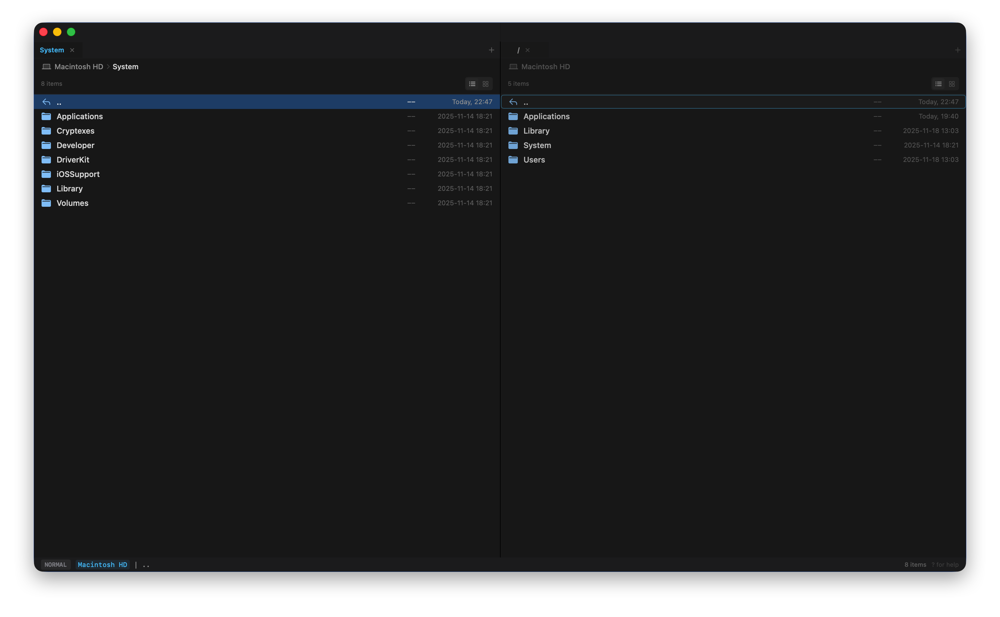

# Zenith Commander 🚀

**Zenith Commander** 是一款专为 macOS 打造的原生双栏文件管理器。它将 Total Commander 的高效双栏设计与 Vim 的模态操作哲学完美融合，旨在为开发者和键盘极客提供极致的文件管理体验。



> **"极客的效率，原生的优雅。"**

---

## ✨ 核心特性

### ⚡️ 双面板架构 (Dual-Pane)

经典的左右分栏设计，让文件在两个目录间的移动、复制操作变得直观高效。每个面板独立运作，支持独立的标签页系统。

### 🎹 Vim 模态交互

告别鼠标依赖，双手不离键盘完成所有操作。完整支持 **9 种操作模式**：

| 模式         | 说明                               | 进入方式            |
| ------------ | ---------------------------------- | ------------------- |
| **NORMAL**   | 默认模式，用于导航和基础操作       | `Esc`               |
| **VISUAL**   | 多选模式，选择多个文件进行批量操作 | `v`                 |
| **COMMAND**  | 命令模式，输入 Ex 风格命令         | `:`                 |
| **FILTER**   | 过滤模式，实时筛选文件列表         | `/`                 |
| **DRIVES**   | 驱动器选择，快速切换磁盘卷         | `Shift+D`           |
| **RENAME**   | 批量重命名模式                     | Visual 模式下按 `r` |
| **SETTINGS** | 设置模式，自定义应用配置           | `⌘,`                |
| **AI**       | AI 分析模式，智能文件摘要          | `Shift+A`           |
| **HELP**     | 帮助模式，查看快捷键参考           | `?`                 |

### 📑 多标签页系统

- 每个面板支持独立的多标签页
- 工作区状态自动记忆
- 快速在不同工作目录间切换
- 支持标签页的新建、关闭和切换

### 🔖 书签系统

- 将常用目录添加为书签，一键直达
- 可视化书签栏，快速访问收藏位置
- 支持书签的增删管理

### 🛠 极客工具箱

- **批量重命名**: 支持 `{n}` 计数器、`{date}` 日期变量、正则表达式替换
- **Command 模式命令**: 类 Vim Ex 命令支持
  - `mkdir <name>` - 创建目录
  - `touch <name>` - 创建文件
  - `mv <src> <dest>` - 移动文件
  - `cp <src> <dest>` - 复制文件
  - `rm <name>` - 删除文件
  - `cd <path>` - 切换目录
  - `open` - 打开选中文件
  - `term` - 在当前目录打开终端
- **快速终端启动**: 一键在当前目录启动 Terminal
- **实时文件过滤**: 输入关键词即时筛选文件列表

### 🎨 外观定制

- 纯原生 SwiftUI 开发，轻量流畅
- 完美适配 macOS 浅色/深色模式
- 支持主题切换（浅色/深色/跟随系统）
- 可自定义字体大小（10-24pt）和行高（1.0-2.0）
- 列表/网格两种视图模式

## 📥 安装与构建

### 系统要求

- **macOS** 14.0 (Sonoma) 或更高版本
- **Xcode** 15.0+
- **Swift** 5.9+

### 本地构建

1. **克隆仓库**:

   ```bash
   git clone https://github.com/lihuu/Zenith_Commander.git
   cd Zenith_Commander
   ```

2. **打开项目**:

   使用 Xcode 打开 `Zenith Commander.xcodeproj`

3. **运行**:

   按下 `⌘R` 编译并运行

### 首次运行

首次启动时，应用会请求访问用户目录的权限。请在系统设置中授予"完全磁盘访问"权限以获得最佳体验。

---

## 🎮 快捷键指南 (Cheat Sheet)

按 `?` 键可随时在应用内查看完整快捷键列表。

### 🧭 导航 (Normal Mode)

| 按键      | 功能                        |
| --------- | --------------------------- |
| `↑` / `k` | 向上移动光标                |
| `↓` / `j` | 向下移动光标                |
| `←` / `h` | 返回上级目录 / 网格模式左移 |
| `→` / `l` | 进入目录 / 网格模式右移     |
| `g`       | 跳转到列表首项              |
| `G`       | 跳转到列表末项              |
| `Tab`     | 切换左右面板焦点            |
| `Enter`   | 打开文件 / 进入目录         |

### 🔀 模式切换

| 按键      | 功能                    |
| --------- | ----------------------- |
| `v`       | 进入/退出 Visual 模式   |
| `:`       | 进入 Command 模式       |
| `/`       | 进入 Filter 模式        |
| `Shift+D` | 打开驱动器选择器        |
| `?`       | 打开帮助                |
| `Esc`     | 退出当前模式 / 取消操作 |

### 📝 文件操作

| 按键      | 功能                                         |
| --------- | -------------------------------------------- |
| `y`       | 复制选中文件 (Yank)                          |
| `p`       | 粘贴文件 (Paste)                             |
| `r`       | 刷新当前目录（Normal）/ 批量重命名（Visual） |
| `Shift+A` | AI 分析选中文件                              |

### 📑 标签页

| 按键      | 功能               |
| --------- | ------------------ |
| `t`       | 新建标签页         |
| `w`       | 关闭当前标签页     |
| `Shift+H` | 切换到上一个标签页 |
| `Shift+L` | 切换到下一个标签页 |

### 🔖 书签

| 按键 | 功能                 |
| ---- | -------------------- |
| `b`  | 显示/隐藏书签栏      |
| `⌘B` | 将当前目录添加到书签 |

### ⚙️ 设置

| 按键     | 功能                           |
| -------- | ------------------------------ |
| `⌘,`     | 打开设置面板                   |
| `Ctrl+T` | 切换主题（浅色/深色/跟随系统） |

### 💻 Command 模式命令

| 命令                  | 说明                   |
| --------------------- | ---------------------- |
| `:q` / `:quit`        | 退出应用               |
| `:cd <path>`          | 切换到指定目录         |
| `:open`               | 打开选中文件           |
| `:term` / `:terminal` | 在当前目录打开终端     |
| `:mkdir <name>`       | 创建新目录             |
| `:touch <name>`       | 创建新文件             |
| `:mv <dest>`          | 移动选中文件到目标位置 |
| `:mv <src> <dest>`    | 移动指定文件           |
| `:cp <dest>`          | 复制选中文件到目标位置 |
| `:cp <src> <dest>`    | 复制指定文件           |
| `:rm`                 | 删除选中文件           |
| `:rm <name>`          | 删除指定文件           |

---

## 📸 功能详解

### 1. 批量重命名 (Batch Rename)

强大的批量重命名功能，支持：

- **变量替换**:
  - `{n}` - 自动递增序号（可设置起始值和步长）
  - `{date}` - 当前日期
  - `{name}` - 原文件名
  - `{ext}` - 原扩展名
- **正则表达式**: 使用正则模式进行复杂的查找替换
- **实时预览**: 重命名前预览所有更改效果
- **安全操作**: 检测命名冲突，防止数据丢失

**使用方法**: 在 Visual 模式 (`v`) 下选中多个文件，然后按 `r` 打开重命名面板。

### 2. 过滤模式 (Filter)

实时筛选当前目录的文件列表：

- 支持模糊匹配
- 即时响应，输入即筛选
- 按 `Esc` 清除筛选并返回完整列表

**使用方法**: 按 `/` 进入过滤模式，输入关键词。

### 3. 驱动器选择 (Drive Select)

快速切换到不同的磁盘卷：

- 显示所有挂载的磁盘
- 显示磁盘容量和可用空间
- 支持外接硬盘、U 盘等

**使用方法**: 按 `Shift+D` 打开选择器。

---

## 🗺 开发路线图

### 已完成 ✅

- [x] 基础双栏布局与 Vim 导航
- [x] 多标签页支持
- [x] 批量重命名（含正则表达式支持）
- [x] 列表/网格视图切换
- [x] Command 模式命令 (mkdir, touch, mv, cp, rm, cd)
- [x] 书签系统
- [x] AI 文件分析 (Gemini)
- [x] 主题切换与外观定制
- [x] 帮助系统

### 计划中 🚧

- [ ] 插件系统 (Lua/JavaScript)
- [ ] Git 状态深度集成
- [ ] 文件预览面板
- [ ] 自定义快捷键映射
- [ ] 文件搜索功能
- [ ] 存档文件浏览 (ZIP/TAR)

---

## 🏗 项目结构

```
Zenith Commander/
├── Models/          # 数据模型
│   ├── AppMode.swift       # 模式定义
│   ├── AppState.swift      # 应用状态
│   ├── Bookmark.swift      # 书签模型
│   ├── FileItem.swift      # 文件项模型
│   └── Settings.swift      # 设置模型
├── Services/        # 服务层
│   ├── CommandParser.swift     # 命令解析器
│   ├── DirectoryMonitor.swift  # 目录监控
│   ├── FileSystemService.swift # 文件系统服务
│   └── Logger.swift            # 日志服务
├── Theme/           # 主题系统
│   ├── Theme.swift         # 主题定义
│   └── ThemeManager.swift  # 主题管理器
└── Views/           # 视图层
    ├── MainView.swift      # 主视图
    ├── PaneView.swift      # 面板视图
    ├── SettingsView.swift  # 设置视图
    └── Components/         # UI 组件
```

---

## 🤝 贡献

欢迎提交 Issue 和 Pull Request！

### 开发指南

1. Fork 本仓库
2. 创建功能分支 (`git checkout -b feature/AmazingFeature`)
3. 提交更改 (`git commit -m 'Add some AmazingFeature'`)
4. 推送到分支 (`git push origin feature/AmazingFeature`)
5. 打开 Pull Request

### 测试

在提交 PR 之前，请确保：

```bash
# 运行单元测试
xcodebuild test -scheme "Zenith Commander" -destination 'platform=macOS'
```

---

## 📄 许可证

本项目基于 [MIT 许可证](LICENSE) 开源。

---

## 🙏 致谢

- [Total Commander](https://www.ghisler.com/) - 双栏文件管理器的灵感来源
- [Vim](https://www.vim.org/) - 模态编辑哲学的启发
- [SwiftUI](https://developer.apple.com/xcode/swiftui/) - 优雅的原生 UI 框架

---

<p align="center">
  <sub>Made with ❤️ for keyboard enthusiasts</sub>
</p>
