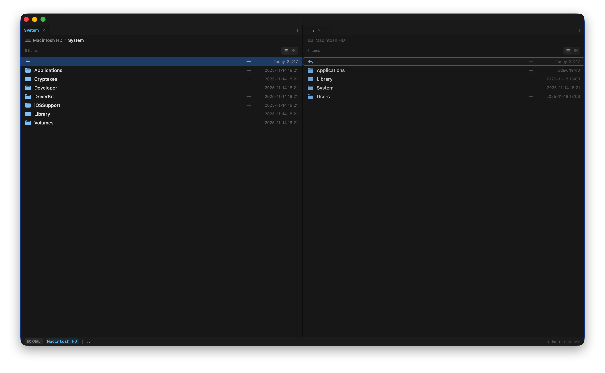

# Zenith Commander 🚀

**Zenith Commander** is a native macOS dual-pane file manager designed specifically for developers and keyboard enthusiasts. It seamlessly combines Total Commander's efficient dual-pane design with Vim's modal interaction philosophy, delivering the ultimate file management experience.



> **"Geek efficiency, native elegance."**

---

## ✨ Core Features

### ⚡️ Dual-Pane Architecture

The classic left-right split design makes file operations between two directories intuitive and efficient. Each pane operates independently with its own tab system.

### 🎹 Vim Modal Interaction

Say goodbye to mouse dependency—complete all operations without leaving the keyboard. Full support for **9 operation modes**:

| Mode         | Description                                   | Entry Method       |
| ------------ | --------------------------------------------- | ------------------ |
| **NORMAL**   | Default mode for navigation and basic ops     | `Esc`              |
| **VISUAL**   | Multi-select mode for batch operations        | `v`                |
| **COMMAND**  | Command mode for Ex-style commands            | `:`                |
| **FILTER**   | Filter mode for real-time file list filtering | `/`                |
| **DRIVES**   | Drive selector for quick volume switching     | `Shift+D`          |
| **RENAME**   | Batch rename mode                             | `r` in Visual mode |
| **SETTINGS** | Settings mode for app configuration           | `⌘,`               |
| **AI**       | AI analysis mode for smart file summaries     | `Shift+A`          |
| **HELP**     | Help mode for shortcut reference              | `?`                |

### 📑 Multi-Tab System

- Independent multi-tab support for each pane
- Automatic workspace state memory
- Quick switching between different working directories
- Support for creating, closing, and switching tabs

### 🔖 Bookmark System

- Add frequently used directories as bookmarks for one-click access
- Visual bookmark bar for quick access to saved locations
- Support for bookmark management (add/remove)

### 🛠 Geek Toolbox

- **Batch Rename**: Supports `{n}` counter, `{date}` date variable, regex replacement
- **Command Mode Commands**: Vim Ex-style command support
  - `mkdir <name>` - Create directory
  - `touch <name>` - Create file
  - `mv <src> <dest>` - Move file
  - `cp <src> <dest>` - Copy file
  - `rm <name>` - Delete file
  - `cd <path>` - Change directory
  - `open` - Open selected file
  - `term` - Open terminal in current directory
- **Quick Terminal Launch**: One-click terminal launch in current directory
- **Real-time File Filtering**: Instant file list filtering by keyword

### 🎨 Appearance Customization

- Pure native SwiftUI development, lightweight and smooth
- Perfect adaptation to macOS light/dark modes
- Theme switching support (Light/Dark/System)
- Customizable font size (10-24pt) and line height (1.0-2.0)
- List/Grid view modes

## 📥 Installation & Build

### System Requirements

- **macOS** 14.0 (Sonoma) or later
- **Xcode** 15.0+
- **Swift** 5.9+

### Local Build

1. **Clone the repository**:

   ```bash
   git clone https://github.com/lihuu/Zenith_Commander.git
   cd Zenith_Commander
   ```

2. **Open the project**:

   Open `Zenith Commander.xcodeproj` with Xcode

3. **Run**:

   Press `⌘R` to build and run

### First Launch

On first launch, the app will request permission to access user directories. Please grant "Full Disk Access" in System Settings for the best experience.

---

## 🎮 Keyboard Shortcuts Guide (Cheat Sheet)

Press `?` to view the complete shortcut list anytime within the app.

### 🧭 Navigation (Normal Mode)

| Key       | Function                           |
| --------- | ---------------------------------- |
| `↑` / `k` | Move cursor up                     |
| `↓` / `j` | Move cursor down                   |
| `←` / `h` | Go to parent directory / Grid left |
| `→` / `l` | Enter directory / Grid right       |
| `g`       | Jump to first item                 |
| `G`       | Jump to last item                  |
| `Tab`     | Switch focus between panes         |
| `Enter`   | Open file / Enter directory        |

### 🔀 Mode Switching

| Key       | Function                   |
| --------- | -------------------------- |
| `v`       | Enter/Exit Visual mode     |
| `:`       | Enter Command mode         |
| `/`       | Enter Filter mode          |
| `Shift+D` | Open drive selector        |
| `?`       | Open help                  |
| `Esc`     | Exit current mode / Cancel |

### 📝 File Operations

| Key       | Function                                           |
| --------- | -------------------------------------------------- |
| `y`       | Copy selected files (Yank)                         |
| `p`       | Paste files (Paste)                                |
| `r`       | Refresh directory (Normal) / Batch rename (Visual) |
| `Shift+A` | AI analyze selected files                          |

### 📑 Tabs

| Key       | Function               |
| --------- | ---------------------- |
| `t`       | New tab                |
| `w`       | Close current tab      |
| `Shift+H` | Switch to previous tab |
| `Shift+L` | Switch to next tab     |

### 🔖 Bookmarks

| Key  | Function                           |
| ---- | ---------------------------------- |
| `b`  | Show/Hide bookmark bar             |
| `⌘B` | Add current directory to bookmarks |

### ⚙️ Settings

| Key      | Function                         |
| -------- | -------------------------------- |
| `⌘,`     | Open settings panel              |
| `Ctrl+T` | Toggle theme (Light/Dark/System) |

### 💻 Command Mode Commands

| Command               | Description                   |
| --------------------- | ----------------------------- |
| `:q` / `:quit`        | Quit application              |
| `:cd <path>`          | Change to specified directory |
| `:open`               | Open selected file            |
| `:term` / `:terminal` | Open terminal in current dir  |
| `:mkdir <name>`       | Create new directory          |
| `:touch <name>`       | Create new file               |
| `:mv <dest>`          | Move selected files to dest   |
| `:mv <src> <dest>`    | Move specified file           |
| `:cp <dest>`          | Copy selected files to dest   |
| `:cp <src> <dest>`    | Copy specified file           |
| `:rm`                 | Delete selected files         |
| `:rm <name>`          | Delete specified file         |

---

## 📸 Feature Details

### 1. Batch Rename

Powerful batch rename functionality supporting:

- **Variable Substitution**:
  - `{n}` - Auto-incrementing number (configurable start value and step)
  - `{date}` - Current date
  - `{name}` - Original filename
  - `{ext}` - Original extension
- **Regular Expressions**: Complex find-and-replace using regex patterns
- **Live Preview**: Preview all changes before renaming
- **Safe Operations**: Conflict detection to prevent data loss

**Usage**: Select multiple files in Visual mode (`v`), then press `r` to open the rename panel.

### 2. Filter Mode

Real-time filtering of the current directory file list:

- Fuzzy matching support
- Instant response—filter as you type
- Press `Esc` to clear filter and return to full list

**Usage**: Press `/` to enter filter mode, then type keywords.

### 3. Drive Select

Quick switching to different disk volumes:

- Display all mounted disks
- Show disk capacity and available space
- Support for external drives, USB drives, etc.

**Usage**: Press `Shift+D` to open the selector.

---

## 🗺 Development Roadmap

### Completed ✅

- [x] Basic dual-pane layout with Vim navigation
- [x] Multi-tab support
- [x] Batch rename (with regex support)
- [x] List/Grid view switching
- [x] Command mode commands (mkdir, touch, mv, cp, rm, cd)
- [x] Bookmark system
- [x] AI file analysis (Gemini)
- [x] Theme switching and appearance customization
- [x] Help system

### Planned 🚧

- [ ] Plugin system (Lua/JavaScript)
- [ ] Deep Git status integration
- [ ] File preview panel
- [ ] Custom keyboard mapping
- [x] File search functionality
- [ ] Archive file browsing (ZIP/TAR)

---

## 🏗 Project Structure

```
Zenith Commander/
├── Models/          # Data models
│   ├── AppMode.swift       # Mode definitions
│   ├── AppState.swift      # Application state
│   ├── Bookmark.swift      # Bookmark model
│   ├── FileItem.swift      # File item model
│   └── Settings.swift      # Settings model
├── Plugins/         # Plugin system
│   ├── Core/               # Core architecture
│   ├── Git/                # Git feature plugin
│   └── Rsync/              # Rsync sync plugin
├── Services/        # Service layer
│   ├── CommandParser.swift     # Command parser
│   ├── DirectoryMonitor.swift  # Directory monitor
│   ├── FileSystemService.swift # File system service
│   └── Logger.swift            # Logging service
├── Theme/           # Theme system
│   ├── Theme.swift         # Theme definitions
│   └── ThemeManager.swift  # Theme manager
└── Views/           # View layer
    ├── MainView.swift      # Main view
    ├── PaneView.swift      # Pane view
    ├── SettingsView.swift  # Settings view
    └── Components/         # UI components
```

---

## 🤝 Contributing

Issues and Pull Requests are welcome!

### Development Guide

1. Fork this repository
2. Create a feature branch (`git checkout -b feature/AmazingFeature`)
3. Commit your changes (`git commit -m 'Add some AmazingFeature'`)
4. Push to the branch (`git push origin feature/AmazingFeature`)
5. Open a Pull Request

### Testing

Before submitting a PR, please ensure:

```bash
# Run unit tests
xcodebuild test -scheme "Zenith Commander" -destination 'platform=macOS'
```

---

## 📄 License

This project is open source under the [MIT License](LICENSE).

---

## 🙏 Acknowledgments

- [Total Commander](https://www.ghisler.com/) - Inspiration for dual-pane file management
- [Vim](https://www.vim.org/) - Inspiration for modal editing philosophy
- [SwiftUI](https://developer.apple.com/xcode/swiftui/) - Elegant native UI framework

---

<p align="center">
  <sub>Made with ❤️ for keyboard enthusiasts</sub>
</p>
