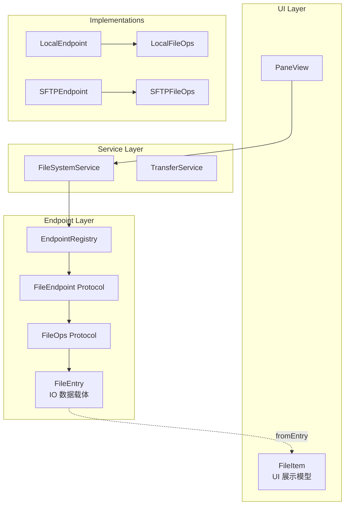
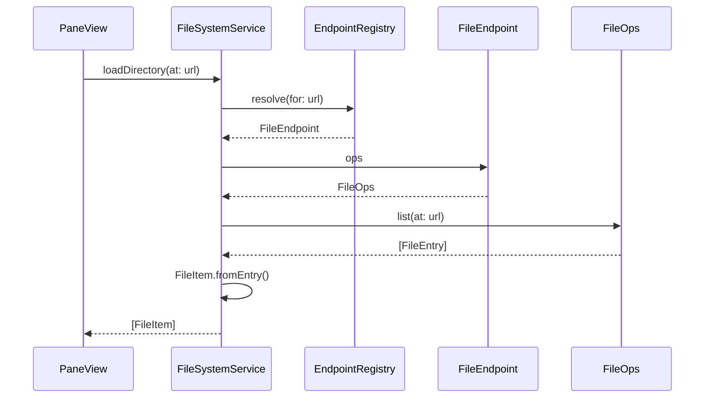
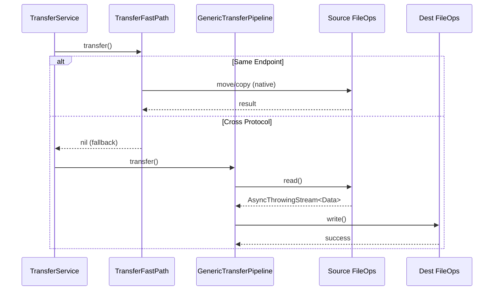

# Endpoint 文件系统架构设计文档

## 概述

本文档描述了 Zenith Commander 文件系统操作的 Endpoint 架构。该架构将 IO 操作与 UI 模型完全分离，支持多协议（本地、SFTP 等）统一处理，并消除了 N×N 传输实现问题。

---

## 架构总览



---

## 核心组件

### 1. FileEntry（IO 数据载体）

**位置**: `Services/Endpoint/FileEntry.swift`

协议无关的文件元数据结构，用于 IO 层传递数据：

```swift
struct FileEntry: Sendable {
    let name: String
    let url: URL
    let type: FileEntryType      // folder/file/symlink/unknown
    let size: Int64?
    let modifiedDate: Date?
    let createdDate: Date?
    let isHidden: Bool
    let permissions: String?
    let fileExtension: String
}
```

**设计原则**:
- 不包含任何 UI 属性（iconName、formattedDate 等）
- 字段允许为 nil（远端可能无法提供完整信息）
- 完全 Sendable，支持跨 actor 传递

---

### 2. FileItem（UI 展示模型）

**位置**: `Models/Entities/FileItem.swift`

纯 UI 展示用模型，不包含任何 IO 操作：

```swift
struct FileItem: Identifiable, Hashable {
    // 基础数据（从 FileEntry 映射）
    let id: String
    let name: String
    let path: URL
    let type: FileType
    let size: Int64
    // ...
    
    // UI 专用属性
    var gitStatus: GitFileStatus
    var formattedSize: String { ... }
    var formattedDate: String { ... }
    var iconName: String { ... }
    
    // 工厂方法
    static func fromEntry(_ entry: FileEntry) -> FileItem
}
```

**设计原则**:
- `fromURL()` 已废弃，使用 `fromEntry()` 
- 不包含 FileManager 或任何 IO 代码
- 所有 UI 增强（图标、格式化、Git 状态）在此层处理

---

### 3. FileOps（文件操作协议）

**位置**: `Services/Endpoint/FileOps.swift`

定义所有文件系统操作的接口：

```swift
protocol FileOps: AnyObject {
    // 目录操作
    func list(at path: URL) async throws -> [FileEntry]
    func stat(at path: URL) async throws -> FileEntry
    func exists(at path: URL) async throws -> Bool
    
    // 创建操作
    func mkdir(at path: URL, name: String, recursive: Bool) async throws -> URL
    func createFile(at path: URL, name: String) async throws -> URL
    
    // 修改操作
    func rename(from source: URL, to destination: URL) async throws
    func trash(at path: URL) async throws  // 软删除
    func delete(at path: URL) async throws // 硬删除
    
    // 流操作（用于传输）
    func read(from path: URL) async throws -> AsyncThrowingStream<Data, Error>
    func write(to path: URL, data: AsyncThrowingStream<Data, Error>) async throws
}
```

**关键设计**:
- 返回 `[FileEntry]` 而非 `[FileItem]`
- 不依赖任何 UI 模型
- 支持流式读写，用于大文件传输

---

### 4. FileEndpoint（端点协议）

**位置**: `Services/Endpoint/FileEndpoint.swift`

表示一个连接的文件系统实例：

```swift
@MainActor
protocol FileEndpoint: AnyObject {
    var kind: EndpointKind { get }
    var ops: FileOps { get }
    func canHandle(_ url: URL) -> Bool
}

// 可选：支持撤销的端点
protocol UndoSupportingEndpoint: FileEndpoint {
    var undoManager: UndoManager? { get set }
}
```

---

### 5. EndpointKind（端点类型）

用于路由和标识的类型安全枚举：

```swift
enum EndpointKind: Hashable, Sendable {
    case local
    case sftp(host: String, port: Int)
    
    var priority: Int  // 用于解析优先级
}
```

**多实例支持**:
- `sftp(host: "", port: 22)` 表示通用 SFTP 处理器
- `sftp(host: "server.com", port: 22)` 表示特定服务器

---

### 6. EndpointRegistry（端点注册表）

**位置**: `Services/Endpoint/FileEndpoint.swift`

URL → FileEndpoint 的解析中心：

```swift
@MainActor
final class EndpointRegistry {
    static let shared = EndpointRegistry()
    
    func register(_ endpoint: FileEndpoint)
    func resolve(for url: URL) -> FileEndpoint?
}
```

**解析策略**:
1. 按 EndpointKind 过滤候选
2. 调用 `canHandle()` 精确匹配
3. 按 priority 排序，返回最高优先级

---

## 数据流

### 目录加载流程



### 文件传输流程



---

## 实现类

### LocalEndpoint / LocalFileOps

**位置**: `Services/Endpoint/LocalEndpoint.swift`

本地文件系统实现：
- 实现 `UndoSupportingEndpoint` 支持撤销
- Security-scoped access 封装
- 使用 NSFileCoordinator 协调

### SFTPEndpoint / SFTPFileOps

**位置**: `Services/Endpoint/SFTPEndpoint.swift`

SFTP 远程文件系统实现：
- 不支持撤销（无 `UndoSupportingEndpoint`）
- 使用 `mft` 库进行 SFTP 操作
- 支持多服务器连接

---

## 设计优势

| 问题 | 解决方案 |
|------|----------|
| N×N 传输实现 | 统一 GenericTransferPipeline，仅需实现 FileOps |
| IO 与 UI 耦合 | FileEntry（IO）与 FileItem（UI）完全分离 |
| 多协议支持 | EndpointRegistry 统一路由 |
| Actor 隔离 | FileEntry Sendable，FileOps nonisolated 方法 |
| 撤销支持 | UndoSupportingEndpoint 可选协议 |

---

## 扩展指南

### 添加新协议（如 SMB）

1. 定义 EndpointKind case：
   ```swift
   case smb(host: String, share: String)
   ```

2. 创建 SMBEndpoint 实现 FileEndpoint

3. 创建 SMBFileOps 实现 FileOps

4. 注册到 EndpointRegistry：
   ```swift
   EndpointRegistry.shared.register(SMBEndpoint())
   ```

传输功能自动可用，无需额外代码。

---

## 文件结构

```
Services/Endpoint/
├── FileEntry.swift        # IO 数据载体
├── FileOps.swift          # 操作协议
├── FileEndpoint.swift     # 端点协议 + 注册表
├── LocalEndpoint.swift    # 本地实现
├── SFTPEndpoint.swift     # SFTP 实现
├── PathRef.swift          # 路径引用
├── TransferService.swift  # 传输入口
├── TransferFastPath.swift # 快速路径
└── GenericTransferPipeline.swift  # 通用管道
```
